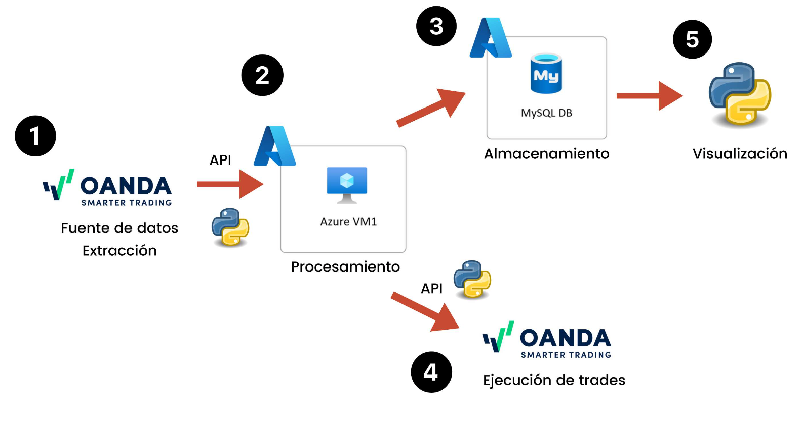

# Trading_Algoritmico

---

### **Objetivo**:
El objetivo del proyecto es desarrollar un sistema de trading algorítmico que emule el ciclo de vida de los datos de mercado, desde su extracción hasta su análisis y ejecución de operaciones en tiempo real, el particular se trabajará con el par EUR/USD. Este sistema se conecta a un broker (OANDA) mediante una API para obtener datos de mercado, procesarlos en una máquina virtual alojada en Azure y ejecutar trades automáticos basados en una estrategia de cruces de medias móviles simples (SMA's). Los datos resultantes son almacenados en una base de datos MySQL en Azure, permitiendo ajustes posteriores de los parámetros estratégicos utilizando Python.




### **Componentes del Sistema**:
1. **Fuente de Datos y Extracción**:
   - **API de Broker (OANDA)**: Se utiliza la API de OANDA para obtener datos de mercado en tiempo real, que son la base para el análisis y ejecución de las operaciones.
   - **Biblioteca `tpqoa`**: Para facilitar la conexión y manipulación de los datos provenientes de OANDA en Python.
  
2. **Procesamiento en Azure**:
   - **Máquina Virtual (Azure VM1)**: Todo el procesamiento de los datos ocurre en una máquina virtual que ejecuta Python. En esta fase, los datos se limpian y estructuran para el análisis posterior.
   - **Preprocesamiento**: Los datos se preparan para análisis técnico, y se trabaja tanto con datos históricos para backtesting como con datos en tiempo real para la ejecución de trades.

   - **Implementación de la Estrategia de Trading**:
      - **Cruce de Medias Móviles (SMA 50/200)**: La estrategia principal se basa en el cruce de medias móviles de diferentes periodos (50 y 200) para generar señales de compra y venta.
      - **TA-Lib**: Utilización de la biblioteca `TA-Lib` para realizar análisis técnico sobre los datos financieros. Esta librería facilita el cálculo de indicadores como las medias móviles.
      - **Backtesting**: Se realiza una prueba retrospectiva de la estrategia con datos históricos, usando la biblioteca `backtesting`. Se utilizan 100 días de datos con granularidad de una hora y se incluyen comisiones del 0.15% para simular un entorno realista.
   
   - **Ajuste de Parámetros**:
      - **Optimización**: Tras el backtesting inicial, se optimizan los parámetros de las medias móviles para mejorar el rendimiento de la estrategia. Estos parámetros ajustados son probados nuevamente para compararlos con los resultados originales.
  
3. **Almacenamiento en MySQL**:
   - **Base de Datos MySQL en Azure**: Todos los datos procesados se almacenan en una base de datos MySQL en Azure para su posterior análisis. Esta base de datos es accesible desde una computadora local mediante MySQL Workbench. Se utiliza la biblioteca `sqlalchemy` para la conexión con la base de datos.
   - **Real-time Data Storage**: Los datos son almacenados de forma continua, permitiendo un acceso inmediato para ajustar los parámetros de la estrategia.

4. **Ejecución en Tiempo Real**:
   - **Ejecución de Trades**: Una vez procesados los datos, la estrategia ejecuta trades en tiempo real utilizando la API de OANDA. Las señales generadas por la estrategia disparan la compra o venta de activos.
   - **Streaming de Datos**: La biblioteca `tpqoa` facilita el acceso y manejo continuo de los datos en tiempo real desde el broker.

5. **Visualización**:
   - **Python para Visualización**: Los resultados y métricas clave de los trades ejecutados, junto con los datos almacenados en la base de datos, se visualizan y analizan mediante Python, lo que permite ajustes adicionales en los parámetros y la estrategia.

---

## ¿Cómo se utilizan los archivos?

* **Paso 1:** Crear una cuenta en el broker de oanda y conectarse a la API.
* **Paso 2:** Llenar el archivo `oanda.cfg` con la informacion recibida en el paso 1
* **Paso 3:** Instalación de la biblioteca `tpqoa` con los siguientes comandos: 
   ```conda update anaconda (recomendado)
   conda install ujson
   pip install v20
   (En algunos casos: pip install pyyaml)
   pip install --upgrade git+https://github.com/yhilpisch/tpqoa.git
   ```
* **Paso 4:** Ejecutar los archivos:
   * El archivo `Back_Broker_EURUSD.ipynb` es un notebook en el cual se hace el backtesting de la estrategia, se comienza con un cruce de SMA's de 50 y 200 periodos. Después, tras hacer la optimización de parámetros se ajusta el cruce de SMA's a 30 y 220 con una muestra de 100 días y una granularidad de una hora
   * El archivo `Cruce_SMA_30_Y_220.ipynb` es un notebook en el cual se implementa la estrategia de trading con los parámetros ajustados y ademas se hace la conexión con la base de datos
   *  El archivo `trading_automatizado.ipynb` es un script de python en el cual se hace la automatización de todo lo establecido en los dos notebooks anteriores, además de fijar el final de la ejecución con base en alguna fecha elegida. Este sería el archivo que se queda ejecutando en la Azure VM por el tiempo determinado.

---

Este flujo permite no solo la ejecución automática de trades en tiempo real, sino también el ajuste continuo basado en el análisis retrospectivo de los datos almacenados en la base de datos MySQL. Esto crea un ciclo de mejora continua que optimiza la estrategia de trading en función de los resultados obtenidos.

## Conclusiones:

* Se logró implementar un sistema que emula el ciclo completo de trading algorítmico, desde la extracción de datos de mercado en tiempo real, su procesamiento, la ejecución de operaciones automáticas y el almacenamiento y visualización de resultados. Este flujo demuestra cómo se pueden integrar diferentes tecnologías (API, Azure, MySQL, Python) en un entorno automatizado.
* Este proyecto ha permitido obtener una visión integral del proceso de trading algorítmico y el manejo de datos en tiempo real, así como la importancia de la infraestructura tecnológica en la automatización de decisiones financieras.
* En futuras iteraciones, se podrían explorar otros indicadores financieros, implementar técnicas de aprendizaje automático, o mejorar la optimización de la estrategia a través de análisis más complejos.
